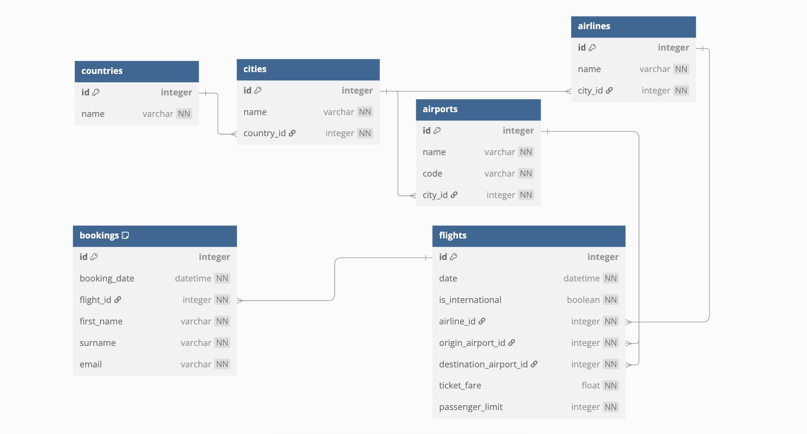

# Liftoff — Terminal Flight Booking System

> **Install dependencies, run a single file, and book flights like it's 1999.**

---

## Getting Started

1. Clone the repository:

```bash
git clone https://github.com/your-username/lift_off_booking.git
cd lift_off_booking
```

2. Install the dependencies:

```bash
pip install -r requirements.txt
```

3. Launch the program:

```bash
python run_me.py
```

---

## Project Overview

**Liftoff** in its current form is a terminal-based flight booking console. It lets users:

- Browse available flights
- Book a ticket
- Cancel existing bookings

I'll totally build a GUI for it to extend my UI portfolio later on.

---

## Database Schema



The project uses a SQLite database designed with normalized relations to ensure integrity and scalability. The key tables in the schema are:

- **Countries**: Stores country names.
- **Cities**: Linked to countries; represents airline HQs and airport locations.
- **Airports**: Each airport is tied to a city and has a unique code.
- **Airlines**: Airline names and headquarters (city reference).
- **Flights**: Represents individual flights with details like date, origin, destination, fare, and passenger capacity.
- **Bookings**: Stores booking details per flight, including passenger info and enforces a constraint preventing duplicate bookings for the same person on the same flight.

Relational integrity is managed with `ForeignKey` relationships and `UniqueConstraints` where applicable.

---

## Long Story Short

This project started as a university assignment where I was tasked with designing a flight booking system using object-oriented programming principles. The system connects to a database, allowing users to book and manage flights through a command-line interface.
 I aimed to follow database best practices throughout the build, including minimizing redundancy and implementing proper constraints.

---

## Tech Stack

- Python 3.12
- SQLAlchemy ORM
- SQLite

---

## Notes

- Data is loaded from `data/*.csv` files on first run.
- The app will create a local `flight_radar.db` SQLite file.
- You can customize the flight and booking data by editing the CSVs.

---

## Contribute?

I had tons of fun coding this thing. Feel free to fork it and build on it. 


_Made with lots of love (＾▽＾)／_  
_– Vndrvs_

---
